# Twit Web application

 <h3>. приложение</h3> 
Мое приложение - это клон социальных сетей, приложение crud, в котором пользователи создают учетные записи и публикуют, редактируют посты, добавляют изображения к постам и комментарии.
Пользователь может зарегистрироваться на веб-сайте, и он увидит все сообщения от других пользователей, и он может сделать Post (Twit).
он может просмотреть свой пост, отредактировать его или удалить. а также он может прокомментировать любой Post.Пользователь также может видеть комментарии к своему посту, которые пришли от других пользователей,
и он может ответить на этот комментарий. 


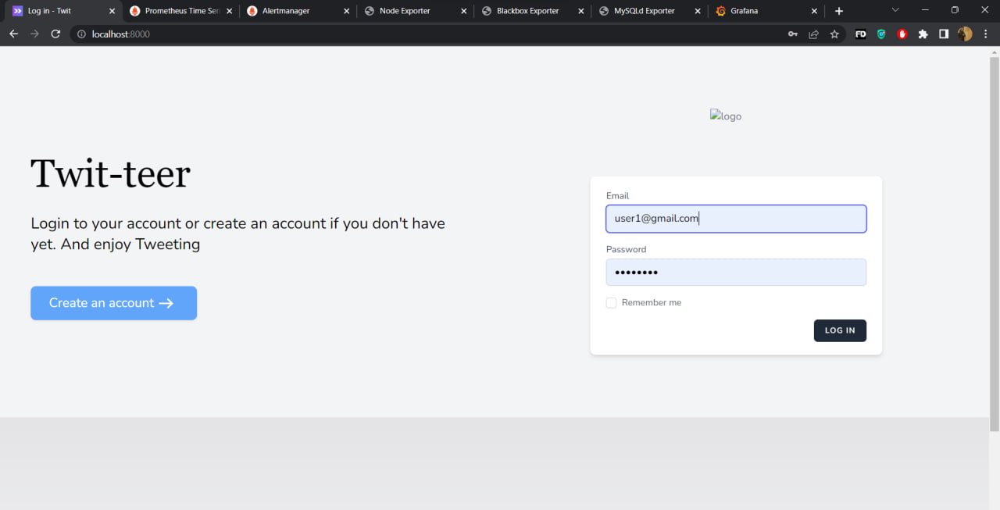


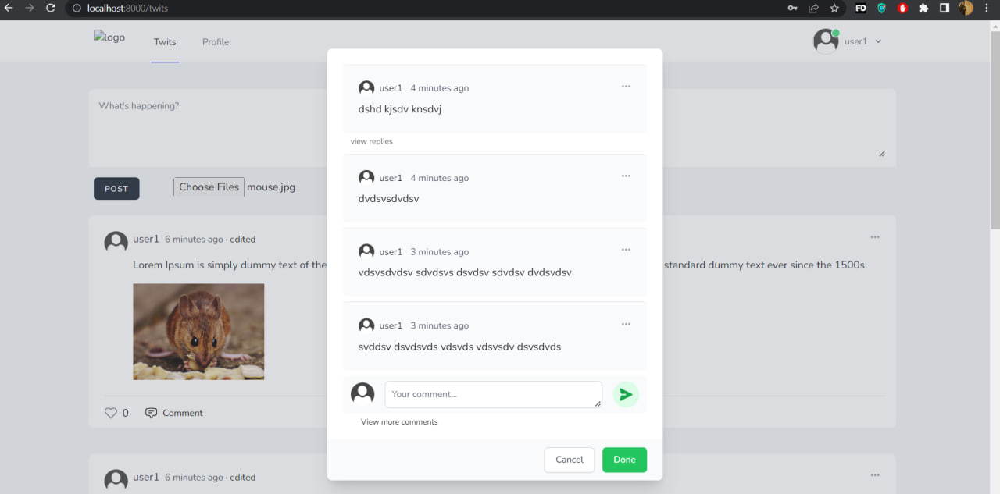


# Построенный с
1. Php 8
2. Laravel 10
3. ReactJs
4. Mysql
5. Docker & docker compose
6. Prometheus Custom metrics
7. Prometheus Alertmanager
8. Node exporter
9. Blackbox exporte
10. Mysql exporter
11. Nginx


# Объяснение
<h3>. Prometheus </h3> 
Prometheus является системой мониторинга с открытым исходным кодом, предназначенной для сбора и анализа метрик из различных систем и приложений. Он позволяет получить информацию о производительности и состоянии системы.Прометей следует модели пассивного мониторинга, периодически запрашивая данные метрик из настроенных источников, таких как серверы, контейнеры или сервисы. Эти источники предоставляют метрики в специальном формате (обычно в формате Prometheus экспозиции), который Прометей может интерпретировать.Собранные метрики хранятся Прометеем в базе данных временных рядов и позволяют выполнять запросы и анализ через мощный язык запросов PromQL (Prometheus Query Language). Этот язык позволяет пользователям создавать сложные запросы и выражения для фильтрации, агрегации и манипуляции собранными метриками.

<h3>. Node Exporter </h3> 
 Node Exporter - это инструмент, который позволяет Прометею собирать информацию о системе и ресурсах хоста, таких как процессор, память, дисковое пространство и сетевые интерфейсы. Он предоставляет метрики, связанные с работой самого узла, которые затем можно использовать для мониторинга и анализа.

<h3>. Blackbox Exporter </h3> 
Blackbox Exporter - это компонент Прометея, который позволяет выполнять активное мониторинговые проверки различных сетевых служб и протоколов, таких как HTTP, DNS, TCP и других. Он позволяет проверять доступность сервисов, проверять работу определенных эндпоинтов и возвращать соответствующие метрики, которые затем могут быть использованы для оповещения и анализа состояния сети.

<h3>. Mysql Exporter </h3> 
MySQL Exporter - это экспортер Прометея, который позволяет собирать метрики и статистику производительности из базы данных MySQL. Он предоставляет информацию о запросах, подключениях, потоках, кэше и других аспектах работы MySQL. Эти метрики могут быть использованы для отслеживания производительности базы данных и выявления проблем.

<h3>. Grafana </h3> 
это инструмент визуализации данных и построения графиков, который часто используется в сочетании с Прометеем. Он позволяет создавать красочные и информативные дашборды, настраивать графики и панели инструментов на основе собранных метрик Прометея. Grafana предлагает широкий спектр визуальных возможностей, которые помогают пользователю легко интерпретировать и анализировать данные мониторинга.


# Шаги по настройке мониторинга

<h3>Шаг 1</h3> 
Создайте файл docker-compose.yml с контейнеры (twit, ngix, mysql, promethesu, mysql-exporter , node-exporter, blackbox-exporter)


```bash
version: '3.8'

networks:
    default:
        external: true
        name: twit_default

services:
    twit:
        build:
            context: .
            dockerfile: Dockerfile
        container_name: twit
        volumes:
            - .:/var/www/html
        depends_on:
            - mysql
            - prometheus
            - mailhog

    nginx:
        image: nginx:latest
        container_name: nginx
        ports:
            - '8000:8000'
        volumes:
            - .:/var/www/html
            - ./prometheus/nginx.conf:/etc/nginx/conf.d/default.conf
        depends_on:
            - twit

    mysql:
        image: mysql:8.0
        ports:
            - '3306:3306'
        environment:
            MYSQL_ROOT_PASSWORD: '${DB_PASSWORD}'
            MYSQL_ROOT_HOST: "%"
            MYSQL_DATABASE: '${DB_DATABASE}'
            MYSQL_PASSWORD: '${DB_PASSWORD}'
        volumes:
            - twit_mysql_data:/var/lib/mysql

    prometheus:
        image: prom/prometheus
        container_name: prometheus
        ports:
            - "9090:9090"
        volumes:
            - ./prometheus:/etc/prometheus
            - ./prometheus/prometheus.yml:/etc/prometheus/prometheus.yml
            - ./prometheus/alert_rules.yml:/etc/prometheus/alert_rules.yml
            - ./prometheus/blackbox.yml:/etc/prometheus/blackbox.yml
        command:
            - --config.file=/etc/prometheus/prometheus.yml
        depends_on:
            - node-exporter
            - blackbox-exporter
            - mysql-exporter

    alertmanager:
        image: prom/alertmanager
        container_name: alertmanager
        ports:
            - "9093:9093"
        volumes:
            - ./prometheus/alertmanager.yml:/etc/alertmanager/alertmanager.yml

    node-exporter:
        image: prom/node-exporter
        container_name: node-exporter
        ports:
            - "9100:9100"

    blackbox-exporter:
        image: bitnami/blackbox-exporter
        volumes:
            - ./prometheus/blackbox.yml:/etc/blackbox_exporter/config.yml
        container_name: blackbox-exporter
        ports:
            - "9115:9115"

    mysql-exporter:
        image: prom/mysqld-exporter
        container_name: mysql-exporter
        ports:
            - "9104:9104"
        environment:
            DATA_SOURCE_NAME: "root:mysecretpassword@(mysql:3306)/Twit"
        command:
            - "--config.my-cnf=/etc/my.cnf"
        volumes:
            - ./my.cnf:/etc/my.cnf


    grafana:
        image: grafana/grafana
        container_name: grafana
        ports:
            - "3000:3000"
        depends_on:
            - prometheus

    mailhog:
        image: mailhog/mailhog
        container_name: mailhog
        ports:
            - "1025:1025"
            - "8025:8025"

volumes:
    twit_mysql_data:

```

<h3>Шаг 2</h3> 
созданный файл Dockerfile

```bash
FROM php:8.2.0-fpm

# Install system dependencies
RUN apt-get update && apt-get install -y \
    libzip-dev \
    zip \
    libpq-dev \
    libfreetype6-dev \
    libjpeg62-turbo-dev \
    libpng-dev \
    curl \
    && docker-php-ext-install zip pdo_mysql pdo_pgsql

# Install GD extension
RUN docker-php-ext-configure gd --with-freetype --with-jpeg \
    && docker-php-ext-install -j$(nproc) gd

# Install Node.js and npm
RUN curl -fsSL https://deb.nodesource.com/setup_14.x | bash -
RUN apt-get install -y nodejs

# Install Composer
RUN curl -sS https://getcomposer.org/installer | php -- --install-dir=/usr/local/bin --filename=composer

WORKDIR /var/www/html

# Copy application files
COPY . .

# Set max_execution_time
RUN echo "php_value[max_execution_time] = 120" >> /usr/local/etc/php/conf.d/docker-php-max-execution-time.ini

# Install PHP dependencies
RUN composer install

# Install Node.js dependencies and build assets
RUN npm install


```

<h3>Шаг 3</h3>
создай Prometheus.yml для настройки prometheus с экспортерами

```bash
global:
  scrape_interval: 15s
  scrape_timeout: 10s

rule_files:
  - "/etc/prometheus/alert_rules.yml"

alerting:
  alertmanagers:
    - static_configs:
        - targets:
            - alertmanager:9093

scrape_configs:
  - job_name: 'nginx'
    metrics_path: '/metrics'
    static_configs:
      - targets: ['nginx:8000']

  - job_name: 'node-exporter'
    static_configs:
      - targets: ['node-exporter:9100']

  - job_name: 'blackbox-exporter'
    params:
      module: ['laravel_app_check', 'laravel_app_requests_check']
    static_configs:
      - targets: ['blackbox-exporter:9115']

  - job_name: 'mysql-exporter'
    static_configs:
      - targets: [ 'mysql-exporter:9104' ]


```
<h3>Шаг 4</h3>
создание файла Nginx конфигурации

```bash
server {
    listen 8000;
    index index.php index.html;
    root /var/www/html/public;

    location / {
        try_files $uri $uri/ /index.php?$query_string;
    }

    location ~ \.php$ {
        fastcgi_pass twit:9000;
        fastcgi_index index.php;
        fastcgi_param SCRIPT_FILENAME $document_root$fastcgi_script_name;
        include fastcgi_params;
    }
}


```

<h3>Шаг 5</h3>
создание  Alertmanager.yml и alert_rules.yml конфигурации

```bash
global:
  resolve_timeout: 5m

route:
  group_by: ['alertname', 'cluster', 'service']
  group_wait: 30s
  group_interval: 5m
  repeat_interval: 3h
  receiver: 'telegram-webhook'
  routes:
    - match:
        severity: critical
      receiver: telegram-webhook

receivers:
  - name: 'telegram-webhook'
    webhook_configs:
      - url: 'telegram_bot_url?chat_id=telegram_bot_chat_id=High+CPU+usage+detected+in+the+app!+Current+value:+{{ $value }}'


```

```bash
groups:
  - name: example
    rules:
      - alert: HighCpuUsage
        expr: 100 - (avg by (instance) (irate(node_cpu_seconds_total{mode="idle"}[5m])) * 100) > 80
        for: 2m
        labels:
          severity: critical
        annotations:
          summary: "High CPU usage detected"
          description: "CPU usage is above 80% for more than 2 minutes."


```
<h3>Шаг 6</h3>
создайте route /metrics в приложении для Prometheus Endpoint 

```bash
Route::middleware([CountRequestsMiddleware::class])->group(function () {
    Route::get('/metrics',[MetricsController::class, 'getMetrics']);
});

```
<h3>Шаг 7</h3>
Создайте Middleware  для считать запроса (Request metrics )


```bash
class CountRequestsMiddleware
{
    private CollectorRegistry $registry;

    public function __construct(CollectorRegistry $registry)
    {
        $this->registry = $registry;
    }

    /**
     * @throws MetricsRegistrationException
     */
    public function handle(Request $request, Closure $next)
    {
        $startTime = microtime(true);

        $response = $next($request);

        $duration = microtime(true) - $startTime;
        $path = $request->getPathInfo();
        $method = $request->getMethod();
        $statusCode = $response->getStatusCode();
        $content = $response->getContent();

        $requestCounter = $this->registry->getOrRegisterCounter(
            'app',
            'request_count',
            'Total number of requests',
            ['path', 'method', 'status_code']
        );
        $requestCounter->incBy(1, [$path, $method, (string) $statusCode]);

        $requestDuration = $this->registry->getOrRegisterHistogram(
            'app',
            'request_duration_seconds',
            'Request duration in seconds',
            ['path', 'method', 'status_code'],
            [0.01, 0.1, 1, 5] // Adjust the buckets as per your needs
        );
        $requestDuration->observe($duration, [$path, $method, (string) $statusCode]);

        $requestSize = $this->registry->getOrRegisterHistogram(
            'app',
            'request_size_bytes',
            'Request size in bytes',
            ['path', 'method']
        );
        $requestSize->observe(strlen($content), [$path, $method]);

        return $response;
    }
}

```
<h3>Шаг 8</h3>
Создайте контроллер для всех metrics

```bash
class MetricsController extends Controller
{


    public function getMetrics(Request $request)
    {

        DB::connection()->enableQueryLog();
        $collectorRegistry = app(CollectorRegistry::class);

        //memory usage metric
        $memoryUsage = memory_get_usage(true);
        $gauge = $collectorRegistry->getOrRegisterGauge('app', 'memory_usage_bytes', 'Memory usage in bytes');
        $gauge->set($memoryUsage);

        // Count the number of registered users
        $usersRegistered = User::count();
        $gauge = $collectorRegistry->getOrRegisterGauge(
            'app',
            'users_registered_total',
            'Total number of registered users'
        );
        $gauge->set($usersRegistered);

        // Count the number of Twits
        $twitsCount = Twit::count();
        $twitsCounter = $collectorRegistry->getOrRegisterGauge(
            'app',
            'twits_total',
            'Total number of Twits'
        );
        $twitsCounter->set($twitsCount);


        // Count the number of comments posted on Twits
        $commentsCount = Comment::count();
        $commentsCounter = $collectorRegistry->getOrRegisterGauge(
            'app',
            'comments_total',
            'Total number of comments posted on Twits'
        );
        $commentsCounter->set($commentsCount);

        // Count the number of likes
        $likesCount = Like::count();
        $likesCounter = $collectorRegistry->getOrRegisterGauge(
            'app',
            'likes_total',
            'Total number of likes'
        );
        $likesCounter->set($likesCount);


        // Count the number of Twit deletions
        $twitDeletionsCount = Twit::onlyTrashed()->count();
        $twitDeletionsCounter = $collectorRegistry->getOrRegisterGauge(
            'app',
            'twit_deletions_total',
            'Total number of Twit deletions'
        );
        $twitDeletionsCounter->set($twitDeletionsCount);

        // Count the number of Twit updates
        $twitUpdatesCount = Twit::whereNotNull('updated_at')->count();
        $twitUpdatesCounter = $collectorRegistry->getOrRegisterGauge(
            'app',
            'twit_updates_total',
            'Total number of Twit updates'
        );
        $twitUpdatesCounter->set($twitUpdatesCount);

        // Count the number of comment deletions
        $commentDeletionsCount = Comment::onlyTrashed()->count();
        $commentDeletionsCounter = $collectorRegistry->getOrRegisterGauge(
            'app',
            'comment_deletions_total',
            'Total number of comment deletions'
        );
        $commentDeletionsCounter->set($commentDeletionsCount);


        // Count the number of comment replies
        $commentRepliesCount = Comment::whereNotNull('parent_id')->count();
        $commentRepliesCounter = $collectorRegistry->getOrRegisterGauge(
            'app',
            'comment_replies_total',
            'Total number of comment replies'
        );
        $commentRepliesCounter->set($commentRepliesCount);


        // Track cache hits and misses
        $cacheHits = Cache::get('cache_hits', 0);
        $cacheMisses = Cache::get('cache_misses', 0);
        $cacheHitsCounter = $collectorRegistry->getOrRegisterCounter(
            'app',
            'cache_hits_total',
            'Total number of cache hits'
        );
        $cacheHitsCounter->incBy($cacheHits);
        $cacheMissesCounter = $collectorRegistry->getOrRegisterCounter(
            'app',
            'cache_misses_total',
            'Total number of cache misses'
        );
        $cacheMissesCounter->incBy($cacheMisses);


//        $exceptionRate = $this->getExceptionRate();
//        $exceptionRateGauge = $collectorRegistry->getOrRegisterGauge(
//            'app',
//            'exception_rate',
//            'Exception rate per minute'
//        );
//        $exceptionRateGauge->set($exceptionRate);


        $renderer = new RenderTextFormat();
        $result = $renderer->render($collectorRegistry->getMetricFamilySamples());

        return response($result, 200)->header('Content-Type', RenderTextFormat::MIME_TYPE);

    }

}

```


# Полученные результаты


###  Docker

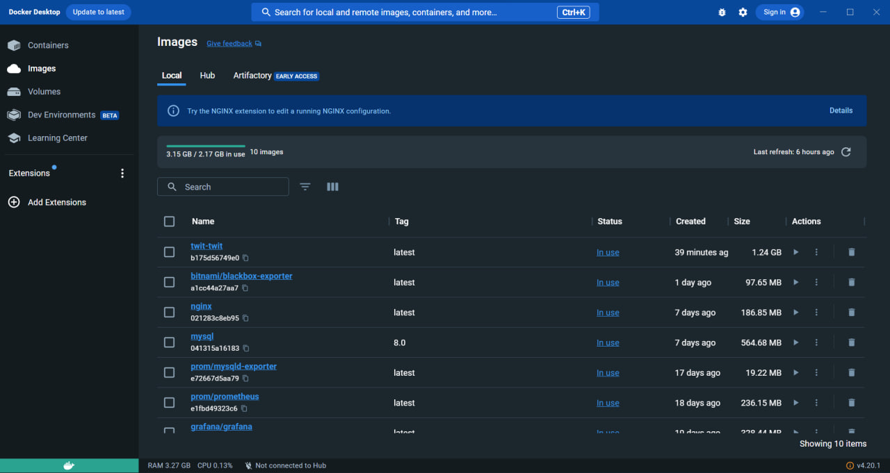


###  metrics в приложении localhost:8000/metrics


### metrics в prometheus localhost:9090


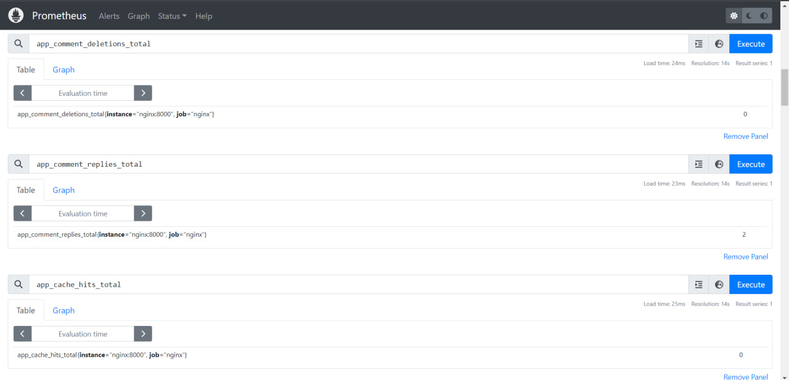

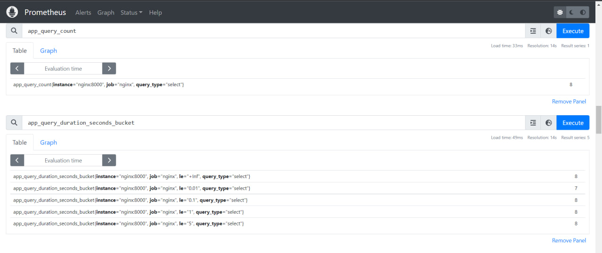


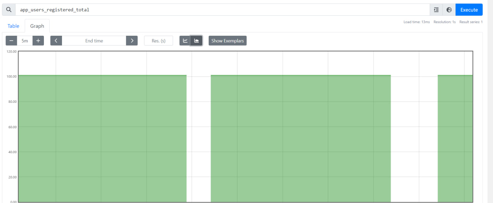

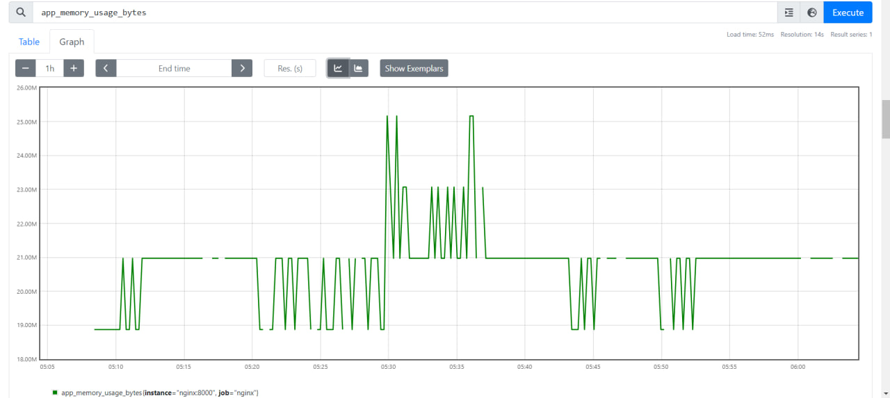

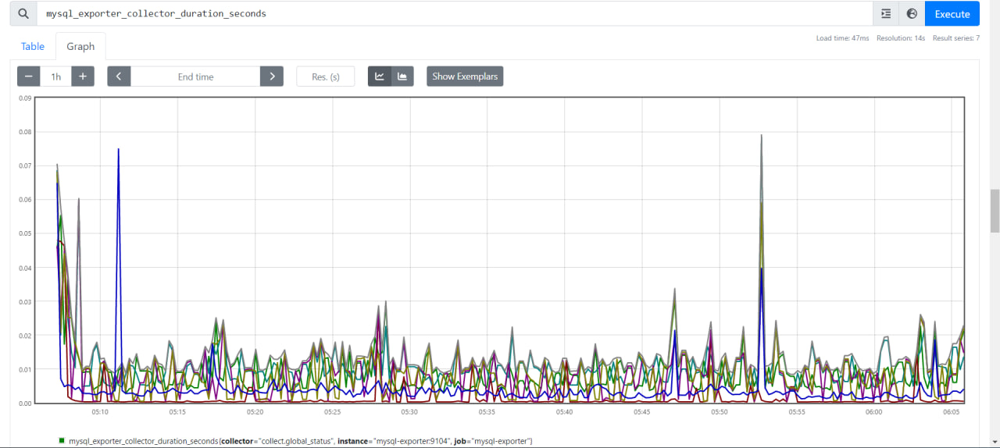

### alertmanager
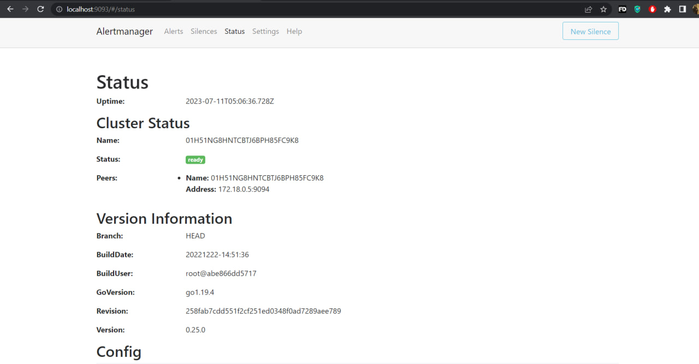

### 4. metrics в Node Exporter
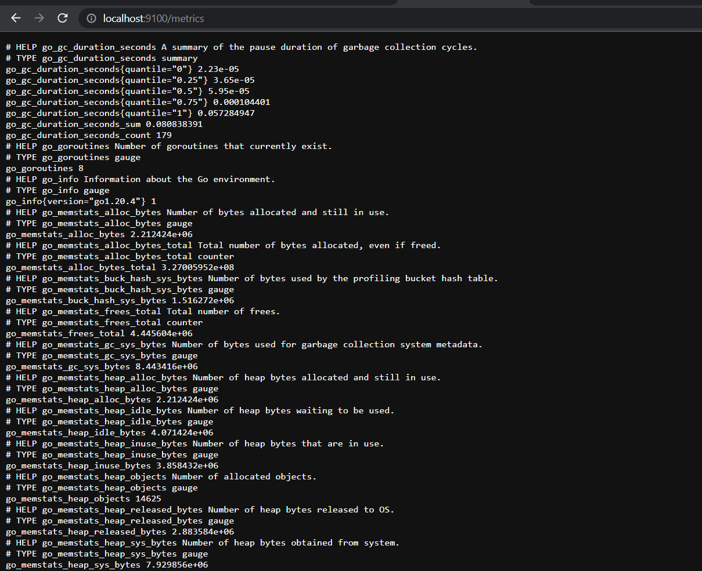


### 4. metrics в Blackbox Exporter


### 4. metrics в Mysql Exporter


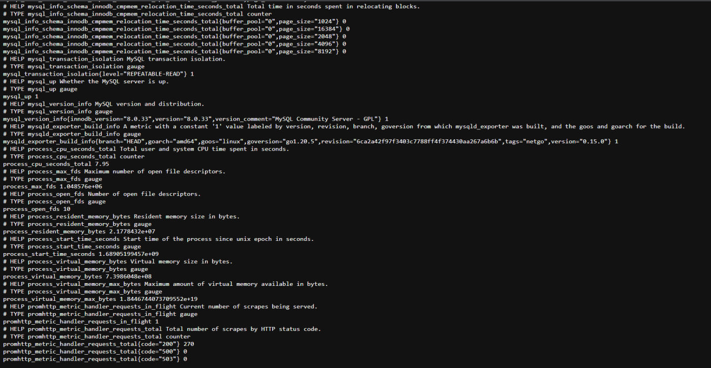

### 4. Grafana


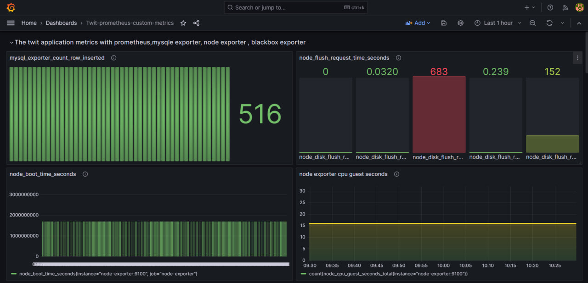
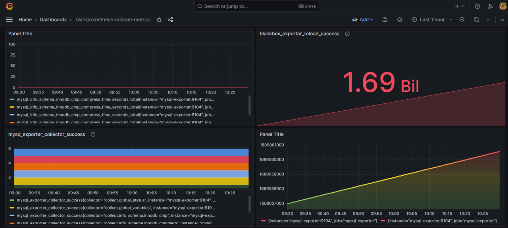
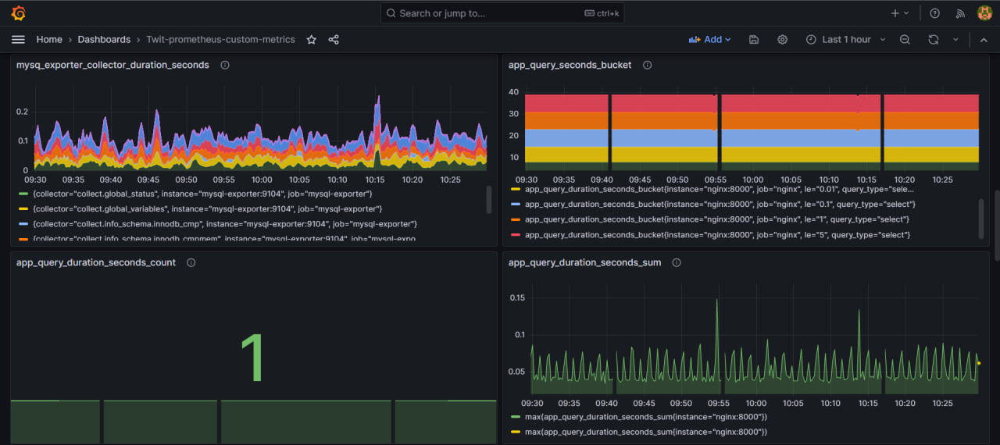
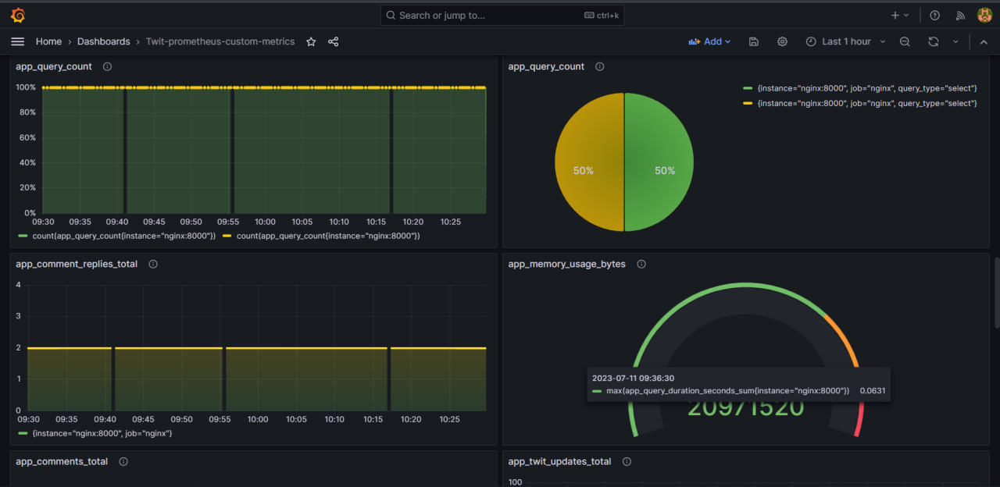


